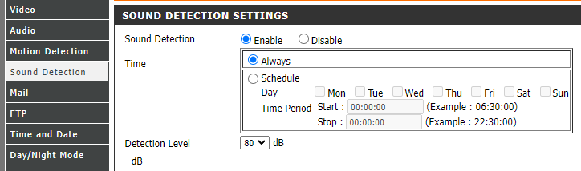

 Plugin CamPatrol
==
---

Description
==

Plugin able to react when one of your camera detect a presence.

Principle
==

Many cameras offer detection. To perform that detection they can used several ways
* An image analysis based on the amount of pixels change
* A human detection based on the artificial intelligence 
* An audio detection over a configurable threshold

In your camera configuration panel, you can choose how it reacts when a detection is triggered.
- Take one/several snapshot(s) (with a delay) or create a video for a time lapse.
- Which process is done with your picture/video. Generally you have the following options
  - Store on the SD Card
  - Send by email
  - Send by FTP
  - **But you never have the option "Alert" Jeedom** 

This plugin allows you to trigger a Jeedom scenario each time there is a camera detection.
You can then choose to:
- Trigger an alarm
- Start the camera recording with the [Jeedom camera plugin](https://doc.jeedom.com/en_US/plugins/security/camera)
- Receive a notification with a [capture](https://doc.jeedom.com/en_US/plugins/security/camera/#Save%20and%20send%20capture)
- Close your shutters
- or any Jeedom actions

> ___All the information requested for the plugin stay in your local network, nothing is send on the internet.___

Compatible Cameras
==

All cameras:
- Which can trigger an event on a detection (motion/human/audio).
- Which have the "send by FTP" feature on detection.

Prerequisite
==

>  The IP Addresses of your cameras and of Jeedom must be **[static](https://community.fs.com/blog/dhcp-vs-static-ip-differences.html).**

Install
==

To install the plugin you have to define
 * A username _(campatrol by default)_
 * A password _(campatrol by default)_
 * The FTP Port _(21 by default)_
 * The IP address: 0.0.0.0 _(do not change it, except if you have network problem, in this case, set the jeedom local addess IP)_

> ___The username and password are free but should not contains [space] * or ?___

Camera Configuration
==

For each of your camera, you have to configure the FTP Server with the data set in Jeedom

> **After the camera configuration, if there is a 'Test' button, click on it to check the settings are correct**

Examples of possible configuration.

For a D-Link camera
--

- Server FTP Configuration
  - Host Name: Set the local IP address of your Jeedom server
  - Port/User Name/Password: Are the settings defined in the install part of the plugin
  - Path: Set the name you want. It can represent the location of the camera
  - Passive Mode: No matter
  
    
- Motion detection configuration

  
- Sound detection configuration (Optional)

  

For an IPCam camera
--

- Server FTP Configuration

  

  
- Motion detection configuration
  
  

- Sound detection configuration (Optional)
  
  

Jeedom Configuration
==

Cameras are automatically created at the first detection or when you test the connection in the camera configuration.

If it is not displayed in the plugin equipments, you can click on the **Synchronisation** button to force it. If this action don't show your camera, check your camera settings against the plugin configuration.

After its creation, you can rename your equipment and change its usual Jeedom parameters.

To no overload Jeedom, in case a camera send a lot of alerts, there is a protection with a minimal delay between 2 alerts. With 60 seconds by default, but you can change it at your convenience.

The equipment provide only one information command. This information will contain the directory and the filename that your camera sent to the Jeedom FTP Server.

Create a scenario on a detection
==

To execute an action on a camera alert, you can create a scénario and select the command of your new equipment in the **Event** field.

