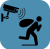 Plugin CamPatrol
==
---

Description
==

Plugin permettant à jeedom de réagir lorsque l'une de vos caméras détecte une présence.

Principe
==

De nombreuse caméras propose de faire de la détection. Elles peuvent utiliser différents procédés
* Une analyse d'image basé sur un % de pixel ayant changé
* Une détection humaine en s'appuyant sur de l'intelligence artificielle
* Une détection sonore au delà d'un certain seuil configurable

Dans la configuration de votre caméra, vous devez choisir comment elle doit réagir lorsqu'elle fait une détection:
- Prendre une/plusieurs photo(s) (avec un interval de temps) ou bien de faire une vidéo pendant un laps de temps.
- Sous quel forme elle conservera/enverra la photo/video. En général vous avez les options suivantes
  - Stocker sur sa carte SD
  - Envoyer par mail
  - Envoyer par FTP
  - **Mais vous n'avez jamais "Alerter" Jeedom** 

Ce Plugin va vous permettre de déclencher un scénario Jeedom à chaque fois que vous aurez une detection de l'une de vos caméra.
Vous pourrez alors choisir de
- Déclencher votre alarme
- Démarrer l'enregistrement avec le [plugin Caméra de jeedom](https://doc.jeedom.com/fr_FR/plugins/security/camera)
- Recevoir une notification avec une [capture](https://doc.jeedom.com/fr_FR/plugins/security/camera/?theme=dark#Enregistrement%20et%20envoi%20de%20capture)
- Fermer vos volets
- ou n'importe quel autre action Jeedom

> ___Toutes les informations nécéssaire au plugin restent locale dans votre réseaux, rien n'est envoyé sur internet.___

Caméras compatibles
==

Toutes les caméras:
- Qui possédent une détection quelconque (mouvement/humaine/audio).
- Qui ont la possibilité de faire un envoie par FTP au moment de la détection.

Prérequis
==

>  Les adresses IP de vos caméras et de Jeedom doivent être **[statique](https://le-routeur-wifi.com/adresse-ip-statique-routeur/).**

Installation
==

L'installation du plugin vous demandera de définir
 * Un nom d'utilisateur _(campatrol par défaut)_
 * Un mot de passe _(campatrol par défaut)_
 * Le Port FTP utilisé _(21 par défaut)_
 * L'addressse IP: 0.0.0.0 _(ne pas changer sauf si vous avez des problèmes reseaux, dans ce cas, entrez l'adresse IP locale de votre jeedom)_

> ___Le nom d'utilisateur et mot de passe sont libres, mais ne doivent pas contenir les caracteres [espace] * ou ?___

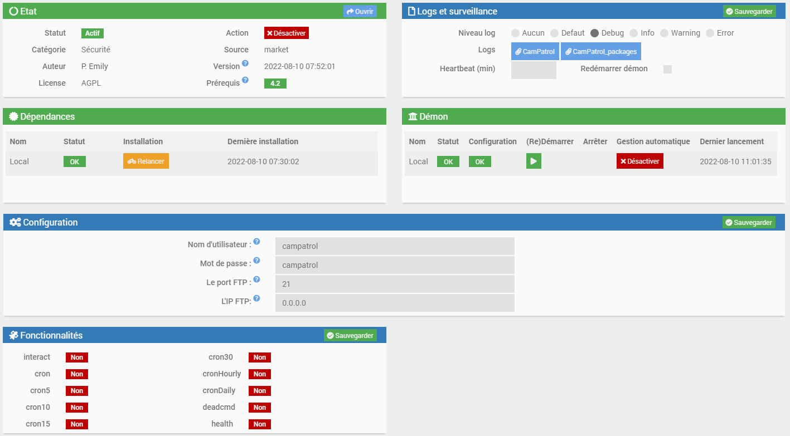

Configuration de votre Caméra
==

Pour chacune de vos caméra, vous devrez configurer le serveur FTP avec les données que vous avez saisie dans Jeedom.

> **Après avoir fait la configuration de la caméra, si vous avez un boutton 'Test', cliquez dessus pour vérifier qu'elle est correcte**

Exemples de configuration possible.

Pour une caméra D-Link
--
- Configuration du serveur FTP
  - Host Name: Mettre l'adresse IP Local de votre serveur Jeedom
  - Port/User Name/Password: Sont les valeurs définies dans la partie installation du plugin
  - Path: mettez le nom que vous souhaitez. Il peut representer le lieu que vous surveillez
  - Passive Mode: Sans importance
   
    
- Configuration de la detection de présence

  
- Configuration de la detection audio (Optionel)
  
  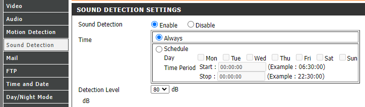

Pour une caméra IPCam
--
- Configuration du serveur FTP

  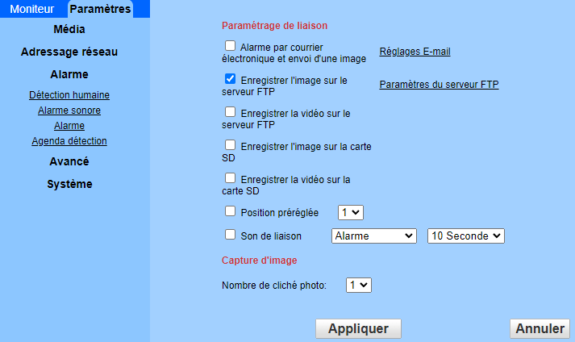
  
  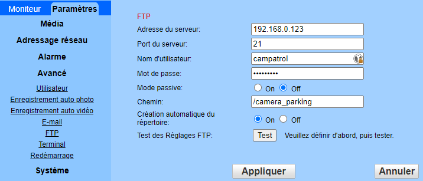
- Configuration de la detection de présence
  
  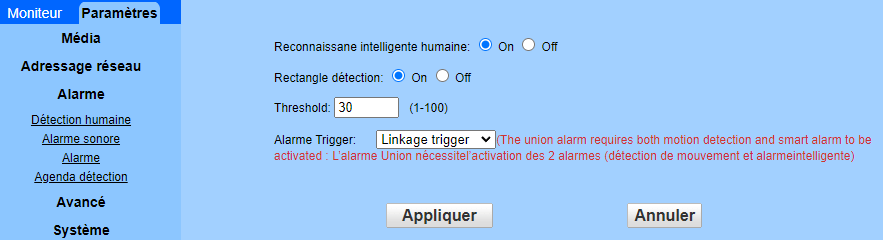
- Configuration de la detection audio (Optionel)
  
  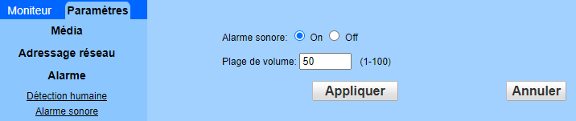

Configuration Jeedom
==

Les caméras sont automatiquement créées à la première détection ou bien au premier test de connection que vous pouvez déclencher dans la partie configuration de la caméra.

Si elle n'apparait pas parmis les équipements du plugin, vous pouvez cliquer sur le boutton **Synchronisation** faire apparaitre l'équipement. Si ce n'est pas le cas, vérifiez vos paramêtres de la caméra avec la configuration du plugin.

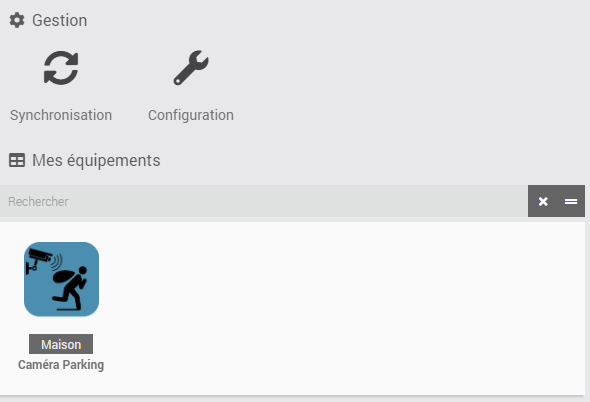

Après avoir été créé, vous pouvez renomer le nom de l'équipement et lui changer les paramêtres classiques de Jeedom.

Pour ne pas surcharger Jeedom, si une caméra se met a envoyer beaucoup d'alertes, il y a une protection avec un temps minimal entre 2 alertes. Par défaut à 60 secondes, mais vous pouvez le changer à votre convenance.

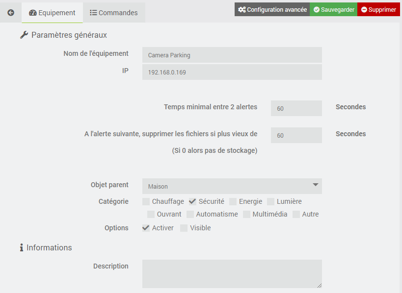

L'équipement fournit une seule commande de type information. Cette information contiendra le repertoire et le nom du fichier que votre caméra a envoyé au serveur FTP de jeedom.

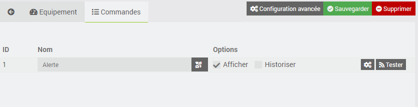

Création d'un scénario sur détection
==

Pour executer une action sur une alerte de votre caméra, vous pouvez créer un scénario et sélectionnez dans le champ **Evénement** la commande de votre nouvel équipement.

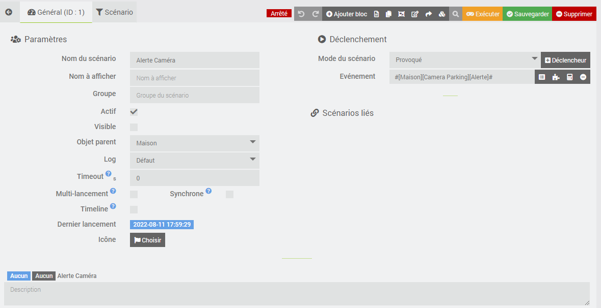

